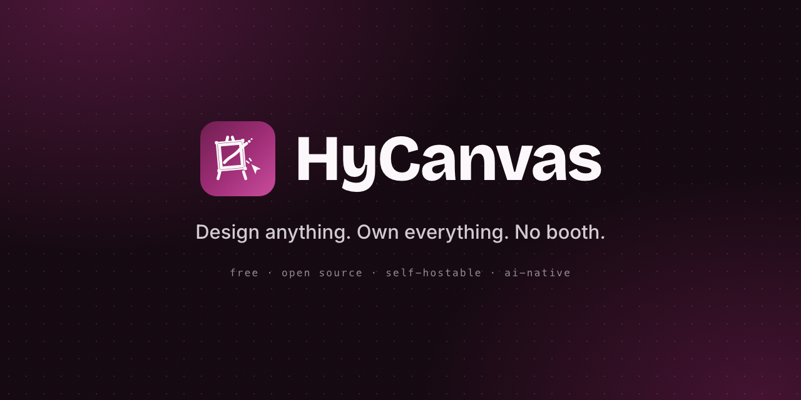

<p align="center">
  
</p>

HyCanvas is a free, self-hostable, AI-native alternative to Canva. Design anything - social graphics, presentations, videos, whiteboards, docs, and print - with no paywalls or watermarks. Web-only.

The product spans a single-player editor, document types (presentations, video, whiteboard, docs, sheets), export, brand kits, and a bring-your-own-key AI layer. Work not yet built is tracked under `docs/roadmap/`.

## Repository Layout

The frontend and shared packages are an npm-workspaces monorepo (orchestrated with concurrently and dotenv-cli against a single shared root `.env`); the backend is a standalone Go module.

- `backend` - Go backend (REST under `/api/v1`, the `/realtime` WebSocket, the Go rendering engine for export, and DB migrations). Serves the exported frontend in the production bundle. Postgres only.
- `frontend` - Next.js app (Pages Router), statically exported for production.
- `packages/*` - framework-agnostic `@hc/*` libraries (schema, engine, editor, sdk, color, text, geometry, export, media, stock, templates, authz, formula, sheets, timeline, whiteboard, docs, publishing, website, print, a11y, ...). The frontend imports them from their built `dist/`.
- `scripts/build-dist.js` - embeds the exported frontend into the Go binary (`go build -tags embed`) and writes the single self-contained `dist/hycanvas`.

## Documentation

- [`docs/`](docs/README.md) - illustrated user and operator guides: [getting started](docs/getting-started.md), [the dashboard](docs/dashboard.md), [the editor](docs/editor.md), [document types](docs/document-types.md), and the [first-run setup wizard](docs/setup-wizard.md) with every step screenshotted.
- `docs/roadmap/` - forward-looking specs for work not yet built (realtime collaboration, AI media, accessibility/i18n/enterprise).
- `CLAUDE.md` - working guidance for this repository.

## Prerequisites

- Node 24 (see `.nvmrc`) for the frontend and shared packages.
- Go 1.25 for the backend (`backend`).
- PostgreSQL. Object storage is optional (S3-compatible / MinIO); the backend falls back to local-file storage.
- ffmpeg only if you want server-side video export (already bundled in the Docker image).

## Development

```bash
cp .env.example .env        # then edit values (at minimum DATABASE_URL + JWT_SECRET)
npm install                 # installs the frontend + shared packages
npm run build:packages      # build the @hc/* libraries once (the frontend imports their dist)
npm run db:migrate          # apply SQL migrations (Go migrator)
npm run dev                 # backend (Go) on :8005, frontend on :3000
```

Open `http://localhost:3000`. The frontend reads the backend base URL from `NEXT_PUBLIC_BACKEND_URL` (defaults to `http://localhost:8005/api`).

Notes for development:
- `npm run build:packages` is required before the first `npm run dev` (and after editing any `packages/*` source), because the `@hc/*` packages are consumed from their compiled `dist/`, not their source. `npm run build` and `npm run build:dist` build the packages for you.
- The server also runs migrations on boot when `DB_AUTO_MIGRATE=true`, so `npm run db:migrate` is mainly for an explicit, pre-boot migration.
- No SMTP is wired: verify-email / password-reset / magic-link links are read from the dev outbox in non-production instead of being emailed.

## Production

The production bundle is a single self-contained binary: `dist/hycanvas`. The statically-exported frontend is baked into it (`go:embed`, built with `-tags embed`), so one binary serves the frontend, the REST API, and the realtime WebSocket on one port, with no Node runtime and no sidecar `public/` folder. It migrates the database on boot. The build also stamps the git version into the binary; it is logged on startup and returned by `/healthz` and `/api/v1/_go/health`.

```bash
npm run build:dist          # builds @hc/* + the frontend (routed to /api), embeds it, and compiles the Go binary into dist/
./dist/hycanvas       # run it directly: the binary loads .env itself, no Node needed
```

Running the bundle needs no Node at all: the Go binary loads a `.env` from the working directory (or its parent) on startup, so `./dist/hycanvas` is fully standalone, exactly how it runs under Docker. Real environment variables always win over `.env`, so injected config (containers, CI) is never overridden. `npm run start:dist:only` is just a convenience alias for the same binary.

If you build the binary without the embedded UI (for example a plain `npm run build:backend`), set `PUBLIC_DIR` to an exported frontend directory to serve it; with neither, the binary serves the API only and shows a short notice page.

In the dist build the frontend talks to the same-origin `/api` (no `NEXT_PUBLIC_BACKEND_URL` needed), so the one process answers UI and API together.

The binary can also run itself as a background service, so no external process manager is needed. `./dist/hycanvas start` (or just `./dist/hycanvas`) runs in the foreground; the `service` verbs manage a detached process with a pidfile and logfile next to the binary, on Linux, macOS, and Windows alike:

```bash
./dist/hycanvas service start       # detach into the background
./dist/hycanvas service status
./dist/hycanvas service log         # last log lines; -f follows
./dist/hycanvas service restart
./dist/hycanvas service stop
```

The binary's directory is the service's working directory, which is where `.env` is read from. The service does not auto-start at boot; if you want that, add a crontab entry (`@reboot /path/to/hycanvas service start`) or use Docker.

### First-run setup wizard

No `.env` yet? Just start the server. On an interactive terminal it first asks whether to set up in the browser or right there in the terminal:

- **Web wizard** (default): the server boots into setup mode and prints a one-time wizard access secret; opening any page redirects to `/installation/step-1`, which asks for that secret and then walks through PostgreSQL, storage (local or S3), and optional SMTP, testing each answer live with visible progress. Step 1 includes "Running HyCanvas behind a proxy?": when enabled you configure the external domain (e.g. `https://hycanvas.art`) separately from the internal host and port the proxy forwards to (written as `APP_URL`, `BIND_HOST`, and `PORT`). Answers are held on the server (never in the browser), and a page refresh always restarts at the welcome step.
- **CLI wizard**: the same questions asked in the terminal, with the same live validation and hidden password input.

Either way the wizard writes `.env` (secrets like `JWT_SECRET` are generated automatically), runs the database migrations, starts the app in the same process, and (in the browser flow) creates your first account. Non-interactive starts (Docker, pipes) default to the web wizard. To skip all of it, create a `.env` by hand (see `.env.example`) before starting.

`npm run deploy` rebuilds the bundle and restarts the running service in one step (`build:dist` + `./dist/hycanvas service restart`).

When writing `.env` by hand for production, set at minimum `NODE_ENV=production`, `DATABASE_URL`, a strong `JWT_SECRET`, `APP_URL` (public base URL used in generated links), and an absolute `LOCAL_STORAGE_PATH` (or `STORAGE_DRIVER=s3` with `S3_*`). AI provider keys are configured per workspace at runtime (stored encrypted), never via env.

### Running behind a reverse proxy

HyCanvas serves plain HTTP; put nginx, Caddy, or Traefik in front for TLS. Three settings matter: `APP_URL` is the external domain the proxy serves (used in generated links and the OIDC redirect), `PORT` is the internal port the proxy forwards to, and `BIND_HOST=127.0.0.1` keeps the app reachable only through the proxy. The setup wizard configures all three when you answer "Running HyCanvas behind a proxy?" in step 1. The proxy must forward the `Host` header and (for realtime collaboration) WebSocket upgrades on `/realtime`. With an https `APP_URL`, session cookies stay `Secure` automatically.

### Sign in with Google (or any OIDC provider)

Social sign-in is configured via env and appears on the login and signup pages once set. For Google:

1. In [Google Cloud Console](https://console.cloud.google.com/apis/credentials), configure the OAuth consent screen, then create an OAuth client ID of type "Web application".
2. Add the authorized redirect URI: `<APP_URL>/api/v1/auth/oidc/callback` (for example `https://hycanvas.art/api/v1/auth/oidc/callback`).
3. Set in `.env` and restart (`./dist/hycanvas service restart`):

```bash
OIDC_ISSUER=https://accounts.google.com
OIDC_CLIENT_ID=<client id>.apps.googleusercontent.com
OIDC_CLIENT_SECRET=<client secret>
OIDC_LABEL=Google
```

A "Continue with Google" button then shows on the auth pages. Any standards-compliant OIDC provider works the same way via its issuer URL; `OIDC_ALLOWED_EMAIL_DOMAINS` restricts sign-in to listed domains, and `OIDC_REDIRECT_URI` overrides the callback when the default does not fit. The issuer must be https (localhost excepted), and `APP_URL` must be set correctly, especially behind a proxy.

### Moving from local storage to S3

Started on local-disk storage and want object storage later? The binary migrates itself:

```bash
./dist/hycanvas service stop       # stop first so no new objects land mid-copy
./dist/hycanvas storage migrate    # copies every object, verifies, updates .env
./dist/hycanvas service start
```

The S3 target (AWS, MinIO, R2, ...) is taken from `S3_*` in the environment when present, or asked interactively with a connectivity check; `--dry-run` previews the object count and size, and `--yes` makes it non-interactive for scripts. The copy is idempotent (already-present objects are skipped, so re-runs are safe), the database needs no changes (it stores storage keys, not URLs), and the local files are kept as a rollback until you delete them.

## Install a prebuilt binary

Releases on the [GitHub releases page](https://github.com/hyscaler/HyCanvas/releases) ship the same self-contained binary prebuilt for Linux (amd64, arm64), macOS (Intel, Apple Silicon), and Windows (amd64). Each archive contains just the `hycanvas` binary (the first-run wizard generates the configuration), and a `SHA256SUMS.txt` accompanies the archives for verification. You still need PostgreSQL; ffmpeg is only required for server-side video export.

```bash
tar -xzf hycanvas_<version>_<os>_<arch>.tar.gz && cd <unpacked dir>
./hycanvas service start    # asks: browser wizard or terminal wizard
```

The macOS binaries are not signed or notarized; if macOS quarantines the download, run `xattr -d com.apple.quarantine hycanvas` or right-click the binary and choose Open.

## Run with Docker (self-host)

The whole product (UI + REST API + realtime WebSocket) runs from one image, with Postgres as a companion service. For the full environment-variable reference and production options, see [DOCKER_SETUP.md](DOCKER_SETUP.md).

### Run the published image (fastest)

The repo ships a `docker-compose.yml` that pulls the prebuilt image (`linux/amd64` and `linux/arm64`) and runs it against your own managed Postgres (it ships no bundled `db`):

```bash
cp .env.example .env   # set JWT_SECRET, APP_PORT, and a reachable DATABASE_URL
docker compose up -d
```

Then open `http://localhost:<APP_PORT>` (e.g. `http://localhost:8005`). `JWT_SECRET`, `APP_PORT`, and a reachable `DATABASE_URL` (or `EXTERNAL_DATABASE_URL`) are required and migrations run on boot; inside a container `localhost` is the container, so use `host.docker.internal` for a DB on your machine (mapped via `extra_hosts`) or a managed endpoint. Update later with `docker compose pull && docker compose up -d`. If you'd rather have Postgres bundled for a quick trial, the self-contained compose in [docker/README.md](docker/README.md) includes a `db` service and runs anywhere.

### Build from source

To run your own source instead of the published image, use the build variant (it builds `Dockerfile` and adds a container healthcheck + restart policy):

```bash
docker compose -f docker-compose.prod.yml up --build -d
```

The build variant serves at `http://localhost:8005`; the published `docker-compose.yml` publishes on the host port you set in `APP_PORT`. Stop with `docker compose down`. The build variant can run a bundled Postgres (`COMPOSE_PROFILES=bundled`); add `-v` to drop that Postgres volume.

Notes:
- ffmpeg (for video export) is bundled in the image; no host install needed.
- Local-file storage persists on the host at `./data/storage` (bind-mounted to `/app/.data/storage`) with the published `docker-compose.yml`, so it survives `docker compose down -v`. To use object storage instead, set the `S3_*` variables on the `app` service.
- Secrets/config (notably `JWT_SECRET`, and optionally `AI_SECRET`, `OIDC_*`, `VAPID_*`) come from your `.env`.
- Database: the published `docker-compose.yml` always uses an external Postgres, set `DATABASE_URL` or `EXTERNAL_DATABASE_URL` in `.env`. The build-from-source `docker-compose.prod.yml` can bundle Postgres with `COMPOSE_PROFILES=bundled`, or point it external by emptying `COMPOSE_PROFILES` and setting `EXTERNAL_DATABASE_URL`. For Postgres on the host, use `host.docker.internal` (both compose files map it via `extra_hosts`).

### Develop in Docker (hot reload)

To work on the code in containers, with no local Go or Node toolchain, use the dev stack. It runs the Go backend on `:8005` and the Next.js dev server on `:3000` with live reload against your working tree:

```bash
docker compose -f docker-compose.dev.yml up --build
```

Open `http://localhost:3000`. See [DOCKER_SETUP.md](DOCKER_SETUP.md#option-c-local-development) for details.

## Environment Variables

All configuration is read from the root `.env` (copy `.env.example`). The most important keys:

| Variable | Mode | Description |
| --- | --- | --- |
| `DATABASE_URL` | both | Postgres connection string. Required. |
| `JWT_SECRET` | both | Signs session tokens (also the fallback key for encrypting AI keys). Use a strong value in production. |
| `PORT` | both | Backend port (default `8005`). |
| `NODE_ENV` | both | `development` or `production`. |
| `DB_AUTO_MIGRATE` | both | When `true`, the server applies migrations on boot. |
| `NEXT_PUBLIC_BACKEND_URL` | dev | Frontend API base in dev (`http://localhost:8005/api`). Unused in the dist build (it calls same-origin `/api`). |
| `FRONTEND_URL` | both | Allowed CORS origin for the API (dev: `http://localhost:3000`). |
| `APP_URL` | prod | Public base URL used in generated links (verify-email, magic-link, share). |
| `STORAGE_DRIVER` | both | `local` (default) or `s3`. |
| `LOCAL_STORAGE_PATH` | both | Absolute path for local-file storage when `STORAGE_DRIVER=local`. Must be absolute so dev and the dist bundle share it. |
| `S3_*` | optional | S3-compatible object storage (endpoint, bucket, keys) when `STORAGE_DRIVER=s3`. |
| `ASSET_QUOTA_BYTES` | optional | Per-workspace upload cap in bytes (default 2 GiB). |
| `USER_STORAGE_QUOTA_BYTES` | optional | Global per-user upload cap across all workspaces; unset/0 = unlimited. For public instances. |
| `AI_SECRET` | optional | Encrypts stored per-workspace AI keys; falls back to `JWT_SECRET`. |
| `OIDC_*` | optional | OIDC single sign-on (issuer, client id/secret). |
| `VAPID_*` | optional | Web-push keys for notifications. |
| `POSTGRES_USER` / `POSTGRES_PASSWORD` / `POSTGRES_DB` / `COMPOSE_PROFILES` | docker | Used by the bundled Postgres in `docker-compose.yml`. |

## Common Scripts

| Command | Description |
| --- | --- |
| `npm run dev` | Run the Go backend and the frontend together with hot reload. |
| `npm run build:packages` | Build the `@hc/*` libraries (needed before dev on a fresh checkout). |
| `npm run build` | Build packages, the Go binary, and the frontend. |
| `npm run gen:theme` | Regenerate color tokens from `frontend/src/theme.config.mjs` (the frontend build runs this automatically). |
| `npm run db:migrate` | Apply SQL migrations (Go migrator). The server also migrates on boot. |
| `npm run lint` | Vet the Go backend and lint the frontend. |
| `npm run test` | Run the package and Go backend tests. |
| `npm run build:dist` | Compile the single `dist/hycanvas` binary with the frontend embedded (`-tags embed`) and the git version stamped in. |
| `npm run start:dist:only` | Run the already-built binary (alias for `./dist/hycanvas`, which loads `.env` itself). |
| `npm run deploy` | Build the dist bundle and restart the built-in service (`hycanvas service restart`). |

## Built-in Templates

The starter template catalog lives in `backend/internal/templates/seed.json` and is compiled into the binary (`//go:embed`). There is no seed command or database step: the templates are served directly from the embedded JSON, merged with any templates saved to the database.

To add or edit a built-in template, edit `seed.json`, then rebuild/restart the backend so it re-embeds the file:

- Development: restart `npm run dev` (it runs the backend via `go run`, which recompiles each start).
- Production (native): `npm run build:dist` then `npm run start:dist:only` (or `npm run deploy`).
- Docker: rebuild from source with `docker compose -f docker-compose.prod.yml up --build` (the default `docker compose up` pulls the published image and won't include local edits).

User-saved templates (Save as template) are stored in the database and need no rebuild.

## Branding and theming

The app's color identity lives in one file: `frontend/src/theme.config.mjs` (the brand and accent scales, the identity gradient, the editor canvas-overlay colors, and the collaborator presence palette). To rebrand, edit that file and run `npm run gen:theme`. The generator rewrites the Tailwind CSS tokens, the typed canvas-overlay constants, and the Go presence palette, so one change propagates across the UI chrome, the gradient, the logo, the favicon/theme-color, the canvas overlays, and presence colors. `npm run gen:theme:check` (run as part of `npm run lint`) fails if the committed generated files drift from the source.

This product/app accent is intentionally separate from the per-workspace Brand Kit, which themes design content rather than the app shell.

## Releases and publishing (maintainers)

Two long-lived branches: `development` (ongoing work) and `stable` (release-ready). Pushing commits builds no Docker images and cuts no releases; CI runs tests only. Releasing is explicit:

1. Merge `development` into `stable` when it is release-ready.
2. Tag on `stable`: `git tag v0.2.0 && git push origin v0.2.0`. The release workflow REFUSES tags whose commit is not on `stable`.

One tag then drives everything (`.github/workflows/release.yml`):

- **Binary release**: the frontend builds once, the embedded binary cross-compiles for all five platforms (pure Go, `CGO_ENABLED=0`), and a GitHub Release is published with the archives and `SHA256SUMS.txt`. Hyphenated tags (`v0.2.0-rc.1`) are marked pre-release.
- **Docker images**, always lean (the `docker` job packages the just-built release binaries into the runtime-only `Dockerfile.release`; no toolchains, no from-source image builds anywhere):
  - a final tag `v0.2.0` publishes `hycanvas/hycanvas:latest`, `:development`, `:0.2.0`, and the rolling minor alias `:0.2`;
  - a pre-release tag `v0.2.0-rc.1` publishes `:development` and `:0.2.0-rc.1` only, so the development channel previews the next release while `latest` stays on the last final one.
- **Docker Hub overview**: any change to `docker/README.md` on `development` is synced to the Docker Hub repository description automatically by `.github/workflows/dockerhub-description.yml` (also runnable manually from the Actions tab).

The Actions "Run workflow" button on the release workflow does a build-only dry run without releasing or publishing images.

The version stamped into the binary (`git describe`) is logged on startup and reported by `/healthz`.

## Conventions

- TypeScript everywhere, strict mode. Keep the rendering engine free of any React or UI dependency.
- For shipped features, match the surrounding code; for unbuilt work, read the relevant `docs/roadmap/` spec first.
- Never use longdash characters or standalone three-hyphen horizontal rules in markdown.

## Contributing

See `CONTRIBUTING.md` for setup and the pull-request checklist, `CODE_OF_CONDUCT.md` for community expectations, and `SECURITY.md` for reporting vulnerabilities.

## License

HyCanvas is licensed under the Elastic License 2.0 (see `LICENSE`). This is a source-available license: you may use, modify, self-host, and redistribute it freely, but you may not provide it to third parties as a hosted or managed service, circumvent the license-key functionality, or remove the licensing notices. Third-party and bundled-asset notices are in `NOTICE`.

© 2026 HyScaler. HyCanvas is a product of HyScaler.
