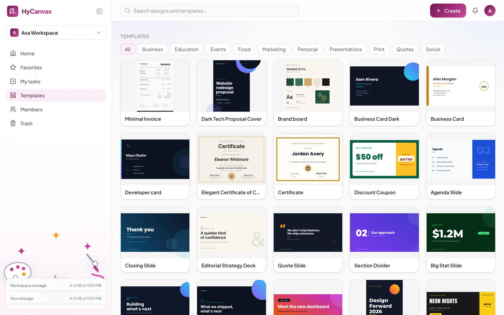
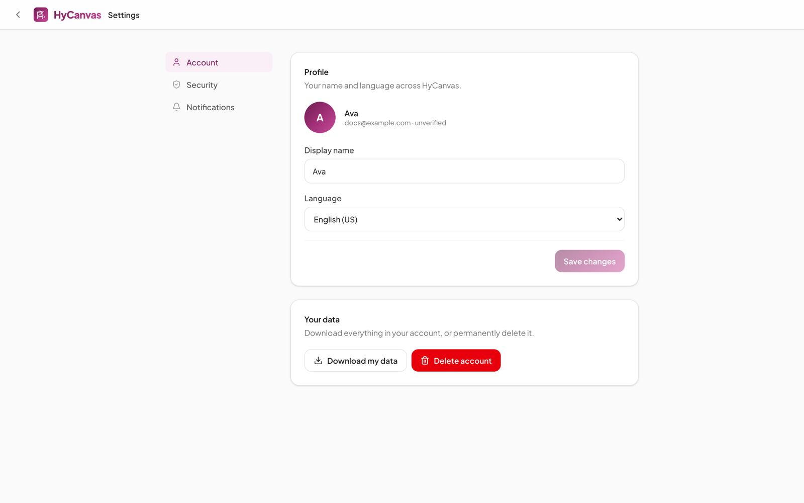

# The Dashboard

The dashboard is the home surface after signing in: it holds your designs, the template library, workspace membership, and your account settings.

## Layout

- **Top bar**: one search box across your designs and the template library, the **Create** button, notifications, and your account menu.
- **Left sidebar**: the workspace switcher, the section rail, and your storage meters. The panel icon next to the logo collapses the sidebar to icons; HyCanvas remembers your choice.
- **Main area**: quick-start format tiles and your recent designs, switchable between grid and list views and sortable by last edited.

## Workspaces

Every design lives in exactly one workspace. You get a personal workspace on signup and can create or join others; the switcher at the top of the sidebar moves between them. Workspace data is isolated: members of one workspace never see another workspace's designs, uploads, or brand kit.

## Sections

- **Home**: quick-start tiles and recent designs.
- **Favorites**: designs you starred.
- **My tasks**: items assigned to you (for example from design comments).
- **Templates**: the template library (below).
- **Members**: who is in the workspace, their roles, and invitations.
- **Trash**: deleted designs, restorable until emptied.

## Templates

The **Templates** section browses the library by category: business, education, events, food, marketing, personal, presentations, print, quotes, and social. Picking a template creates a new design from it in the current workspace. The same library is searchable from the top bar and reachable from the editor.

Self-hosters can curate this library; see [Built-in Templates](../README.md#built-in-templates) in the root README.

## Storage meters

The bottom of the sidebar shows how much storage your uploads use:

- **Workspace storage**: everything uploaded into the current workspace, against the per-workspace limit (`ASSET_QUOTA_BYTES`).
- **Your storage**: everything you personally uploaded across all workspaces, against the per-user limit. This bar appears when the operator sets `USER_STORAGE_QUOTA_BYTES`.

A bar turns red as it approaches its limit. When a limit is reached, uploads are rejected with a message naming which limit was hit; deleting uploads frees space immediately.

## Members and sharing

**Members** lists everyone in the workspace with their role, and is where owners and admins invite people (invitees receive an email link) or remove them. Sharing a single design with specific people or via link happens from the **Share** button inside the editor.

## Account settings

The avatar menu in the top-right opens **Settings**.

- **Account**: display name, language, and your data. **Download my data** exports everything in your account; **Delete account** permanently removes it.
- **Security**: change your password, set up two-factor authentication (TOTP), and link a social sign-in (for example Google) to your account.
- **Notifications**: choose what HyCanvas emails you about.
