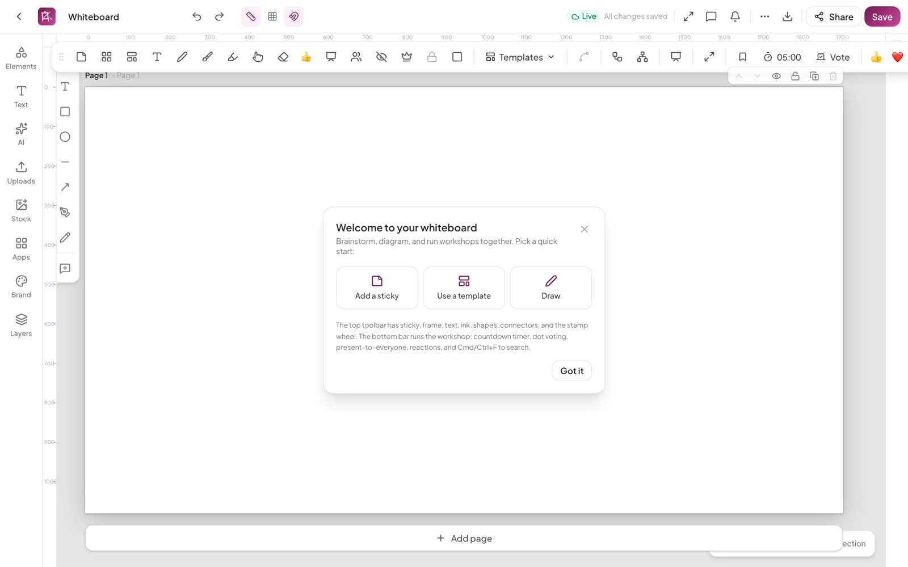
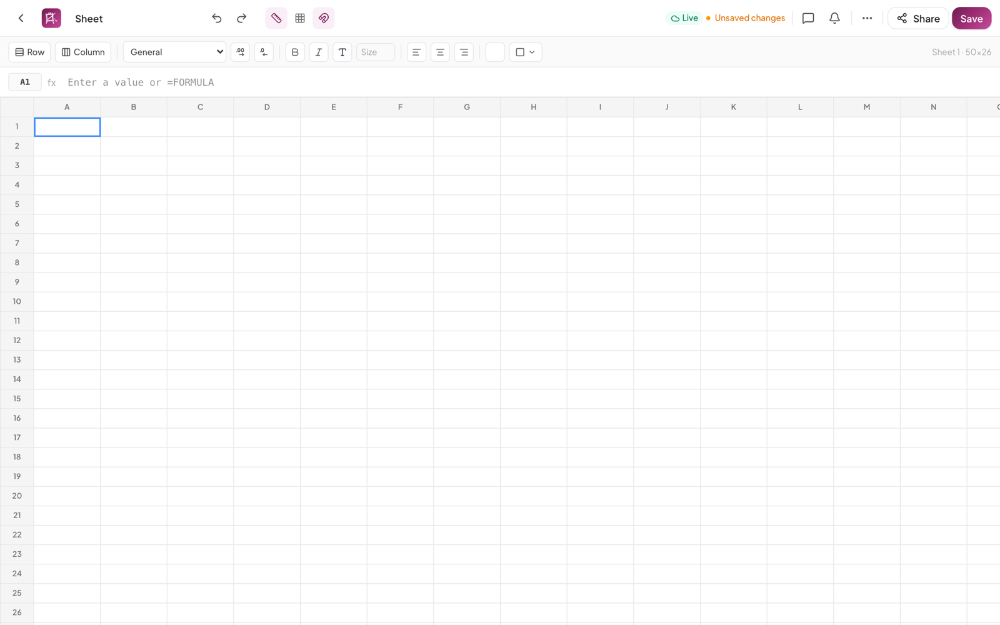
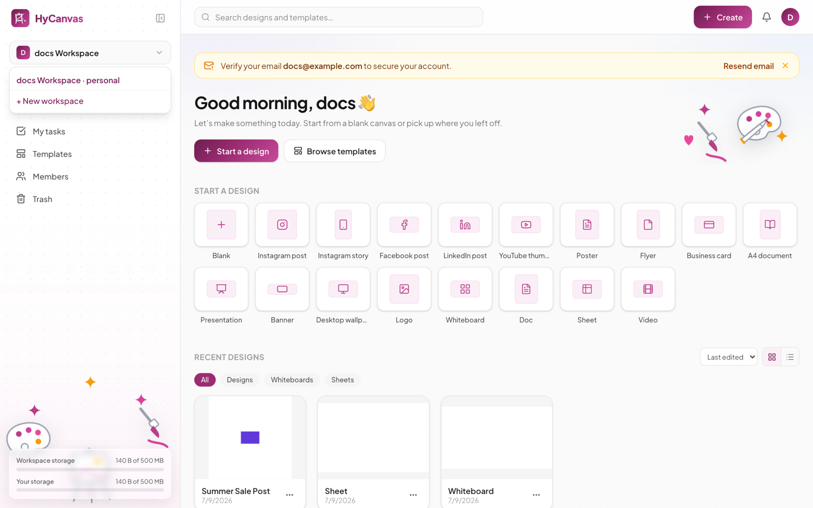
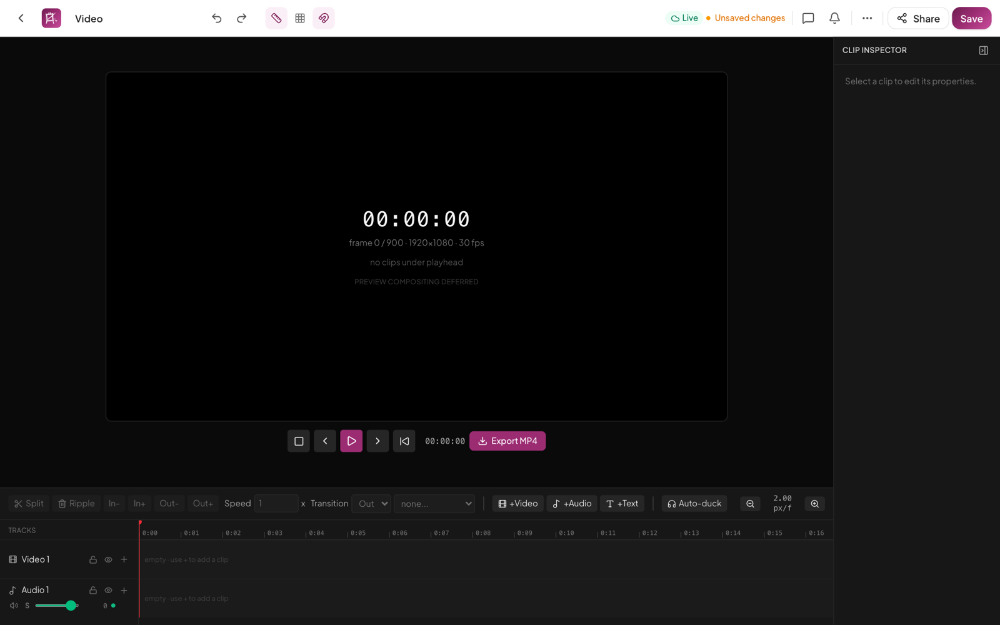

# Document Types

Every HyCanvas document is a design under the hood (one open file format, one editor shell, the same sharing, comments, and version history), but four document kinds mount their own specialized surface: whiteboards, sheets, docs, and video. Presentations are the standard multi-page editor plus present mode. Create any of them from the dashboard's Create menu or the Start-a-design tiles.

## Presentations

Any multi-page design presents. Set per-page transitions and per-element entrance/exit/emphasis animations in the properties panel, add speaker notes and auto-advance dwell under the page's Present section, then hit the play button.

- Transitions: fade, slide, push, dissolve, wipe, flip, zoom, and two morphs, including a Magic Move-style morph that matches elements across slides by id or name.
- Presenter tools: laser pointer (`L`), pen drawing (`D`), spotlight (`O`), zoom (`Z`), black/white blanking (`B`/`W`), jump-to-slide (`G`), loop, and autopilot (`P`).
- The presenter HUD (`S`) shows the current and next slide, speaker notes, and a rehearsal timer with a per-slide time breakdown.

See [the editor guide](editor.md#present-mode) for the full present-mode reference.

## Whiteboards

A collaborative board for brainstorming, diagramming, and workshops, with a floating tool bar and a facilitation bar.

- **Tools**: sticky notes (single or a grid at once), frames/sections, text, pen/marker/highlighter ink, an ephemeral laser pointer, eraser, shapes, a stamp wheel (emoji and dot-vote glyphs), and connectors between nodes (straight, elbow, or curved) with auto-anchors.
- **Diagramming**: auto-layout for flowcharts and a mind-map layout that operate on the connected graph.
- **Templates**: Brainstorm, Retrospective, Flowchart, Mind Map, Kanban Board, User Journey, SWOT Analysis, and Org Chart.
- **Facilitation** (live sessions): present-to-everyone (drive every participant's viewport), bring-everyone-here, a facilitator role with handoff, protected selections, private mode (hide new notes until reveal), and participant moderation.
- **Workshop kit**: a synced countdown timer with presets (including a 25-minute Pomodoro) and an audible chime; dot voting with votes-per-person and anonymous options (server-tallied when online); one-tap emoji reactions; board search (`Cmd/Ctrl+F`); saved views with agenda stepping and deep links.
- **Convert to deck**: one action turns the board into a presentation, one frame per slide.

## Sheets

A spreadsheet surface with a formula engine.

- **Editing**: rows/columns, number formats with decimal controls, bold/italic, text color and size, fill color, alignment, and per-edge borders with color. Every commit is a single undo step.
- **Formulas**: type `=` in the formula bar; the dependency-graph engine ships roughly 48 functions across math (SUM, AVERAGE, ROUND, POWER, ...), logic (IF, IFS, AND, OR, SWITCH, IFERROR), text (CONCAT, LEFT/RIGHT/MID, UPPER/LOWER, TRIM), dates (DATE, TODAY, NOW), lookups (VLOOKUP, LOOKUP), and conditional aggregates (SUMIF, COUNTIF, AVERAGEIF), with standard error values (`#DIV/0!`, `#REF!`, `#CIRCULAR!`, ...).
- Sorting and conditional-formatting display are supported. Not there yet: merged cells, frozen rows/columns, filter views, and function autocomplete.

## Docs

A block-based document editor.

- **Blocks**: text, three heading levels, bullet/numbered/check lists, quotes, code, dividers, images, tables, callouts (info/warn/success), charts, and embeds (YouTube, Vimeo, Spotify, Figma, Google Maps, and sanitized generic embeds). Insert via the menu or change a block's type in place.
- **AI writing tools** (with a connected provider): rewrite, shorten, expand, fix grammar, and summarize, per block.
- **Export**: Markdown client-side; DOCX and PDF render server-side as background jobs.

## Video

A frame-accurate multi-track video editor.

- **Timeline**: video, audio, text, effects, and overlay tracks (reorder with the header arrows, delete from the header with a confirm when clips are on the track; later tracks draw on top); drag clips to move (including across compatible tracks, with a snap guide line), drag their edges to trim (the stage previews the exact trim frame live), split, ripple-delete, copy/paste, duplicate, close gaps, and speed-adjust; shift-click selects multiple clips (drag moves the set, Delete removes it, click empty lane space to clear); right-click a clip, a lane, or the ruler for the context menu (the ruler menu adds markers and sets the export range); drag the fade handles on a clip's top corners to shape audio fades or edge transitions; transitions (cross dissolve, fade, wipe, slide, dip to color) show as a draggable chip at the cut, plus true overlap cross-dissolves (the outgoing clip's handle frames continue under the incoming fade); audio mixing with gain, pan, mute/solo, fades, keyframed volume envelopes (Cmd/Ctrl-drag an audio clip's body to write a gain point, drag the dots to edit, double-click a dot to remove), live per-track level meters, and ducking; ruler markers are draggable (click one to jump the playhead) and the export-range band's edges drag too; a toolbar button cycles compact/normal/tall track heights. Space plays/pauses; arrows step frames; S splits; Delete lifts the selection (Shift+Delete ripple-closes the gap); Cmd/Ctrl+C/V copies and pastes; M toggles a marker; I/O mark the export range.
- **Media**: a resizable, collapsible media panel (drag its edge to resize, double-click to reset; collapse it, the clip inspector, or the whole timeline strip to slim rails, each remembered per user) lists the workspace's video/audio with thumbnails and duration badges; drag onto a lane, click to add at the playhead, upload right there, or record voice, webcam, or your screen straight into the panel; delete an upload from its row. Large videos show an "optimizing preview" badge until their 540p proxy is ready. The panel has filename search and newest/name/size sort, an import-from-URL button, a dot marking assets already on the timeline, and hover-scrub video thumbnails. Video clips show filmstrip thumbnails on the timeline (audio-bearing video also gets a waveform strip) and audio clips show waveforms; both are aligned to the clip's trim, speed, and zoom, so what you see is where content actually sits.
- **Titles**: text tracks hold title cards (top / center / lower-third, size, color, optional background band) with entrance/exit animations (fade, slide, type-on) that composite over the video in the preview and the in-browser export.
- **Green screen**: key a color out of any clip (tolerance, spill suppression, edge feather), rendered live on the stage and in the in-browser export.
- **Color and transform**: per-clip color adjustments (brightness, contrast, saturation, warmth) with one-click filter presets (Vivid, Warm, Cool, Mono, Faded, Noir), plus a static opacity slider, rotation, cover/contain fit, and an edge-based crop tool; all render live, in the in-browser export, and in the server export (color approximately).
- **Animate**: one-click motion presets (fade/pop/slide in and out) and keyframes for a clip's opacity, scale, position, and rotation with selectable easing (linear, ease in/out/in-out), or simply drag the selected clip on the preview stage to reframe it and scroll to scale (writes pose keyframes).
- **Footage tools**: detach a clip's audio to its own track; detect scene cuts in footage and split the clip at each one.
- **Nested sequences**: collapse selected clips into a sequence clip (Nest), double-click to edit it on its own timeline (breadcrumb navigation), recursively composited in the preview and both exports (the server render flattens sequences into the encode graph).
- **Preview**: the stage composites the timeline live (transitions, crops, speed/reverse mapping) and plays the audio mix (clip x track x master gain, fade envelopes, auto-duck) while you scrub or play. The transport shows current/total time (click it to type a time and seek), loops playback (the marked range when set), plays at 0.25x-2x, mutes the preview without affecting exports, and meters the output level.
- **Captions**: a manual cue editor with size/color styling and a burn-in toggle; cues render on the stage and in the export (when burn-in is on), and download as SRT or WebVTT.
- **Project settings**: with nothing selected the right panel shows the project: 24/25/30/50/60 fps (switching re-times clips to keep wall-clock timing), platform-named stage presets (YouTube 16:9, TikTok/Reels 9:16, Instagram square and 4:5, 720p to 4K) plus free custom dimensions and an orientation swap, the stage background color, and an editable total duration (type a longer time to leave trailing space after the last clip). The preview always shows a size/fps readout, so resolution changes are visible even at the same aspect. Selected clips get a friendly, renamable name in the inspector (never a raw id).
- **Export**: one Export dialog covering every format, honoring the I/O export range. Video (exact) renders in the tab in one realtime pass (MP4 where the browser supports it, WebM elsewhere) and captures everything including green screen and keyframes. Video MP4 (fast), WebM, GIF (silent, palette-optimized, up to 15 fps), and MP3 (audio only) render on the server via ffmpeg (multi-track compositing, transitions with true overlap cross-dissolves, titles, burned captions with an opt-out, color/crop adjustments, the full audio mix with sidechain ducking, or a single track exported as a stem) with resolution, quality, and frame-rate knobs and a rough size estimate; wipe/slide render as fades there, and keyframes/green screen/title animations need the in-browser path. An export history popover tracks recent jobs and re-downloads finished server renders.
- **Proxies**: large video uploads get a background 540p preview proxy; the editor scrubs the proxy while exports always use the original; a project-settings toggle forces original-quality preview.
- On the [AI media roadmap](roadmap/23-ai-media.md): auto-captions, chroma-key rendering, beat detection, and generated music/voice.
