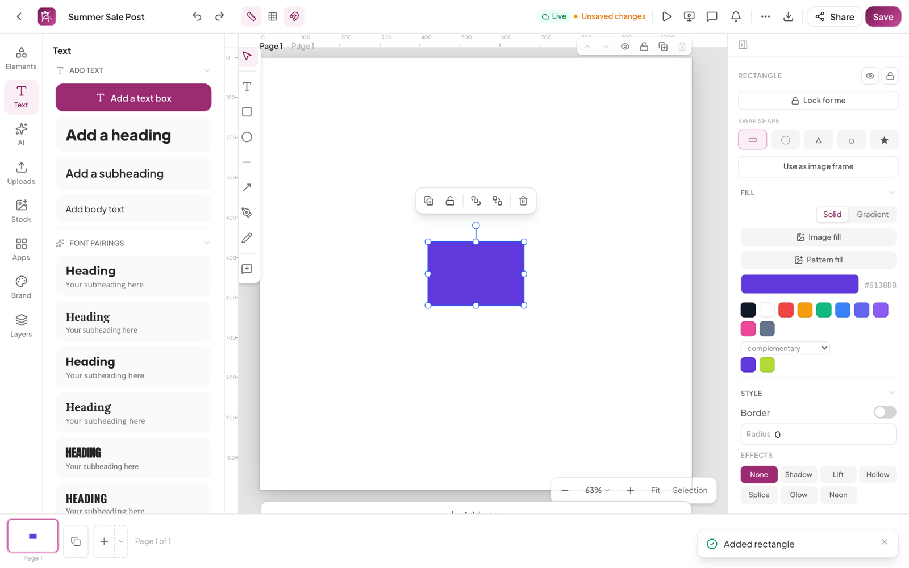
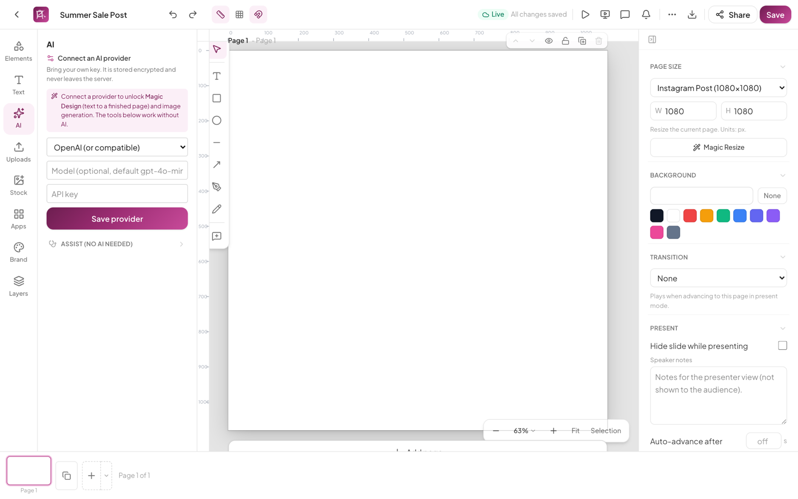
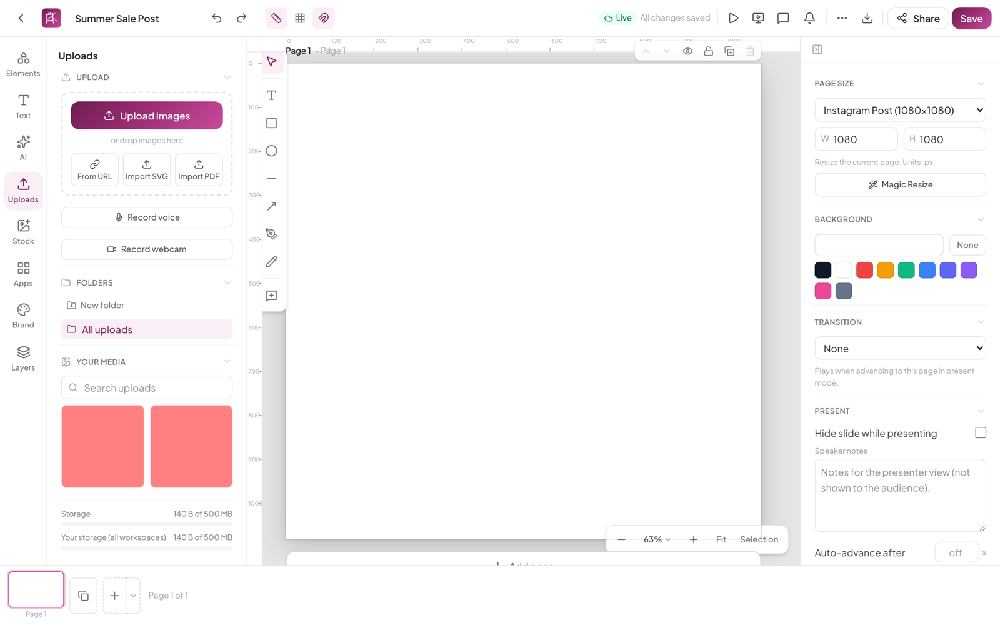
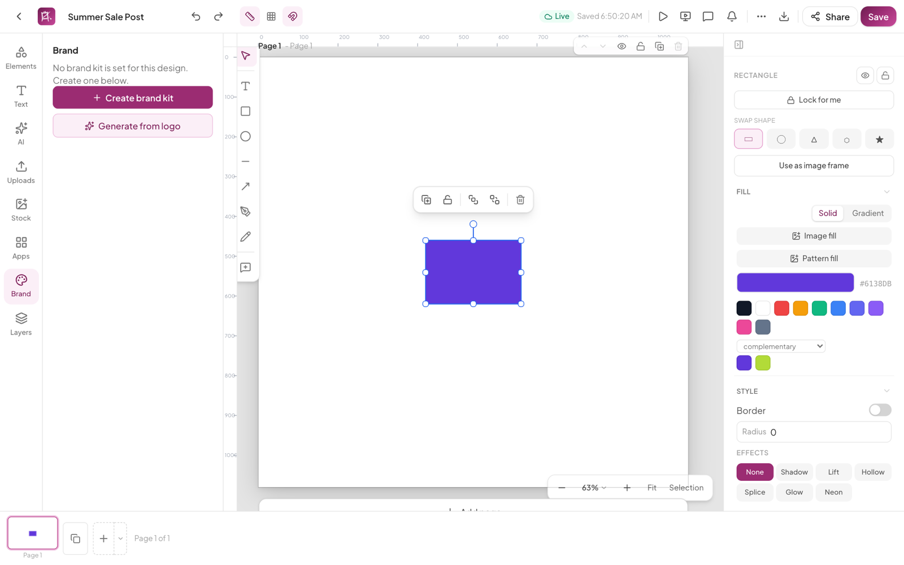
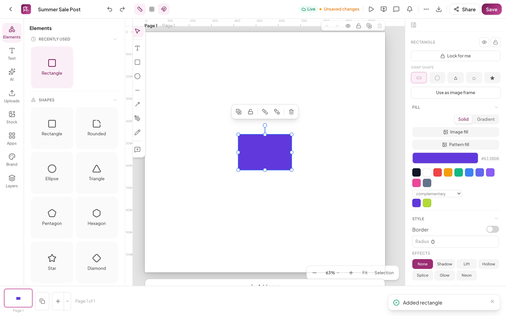
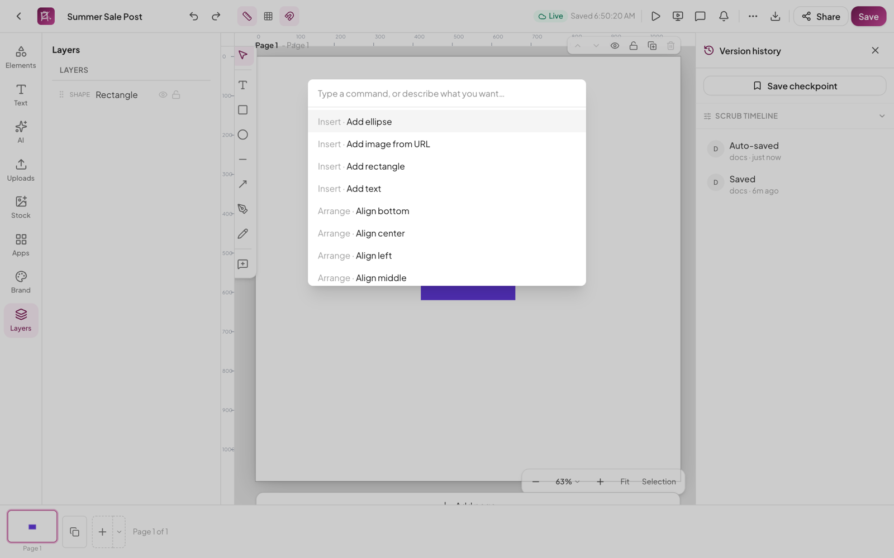
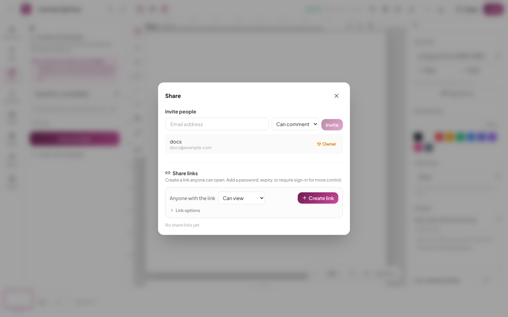
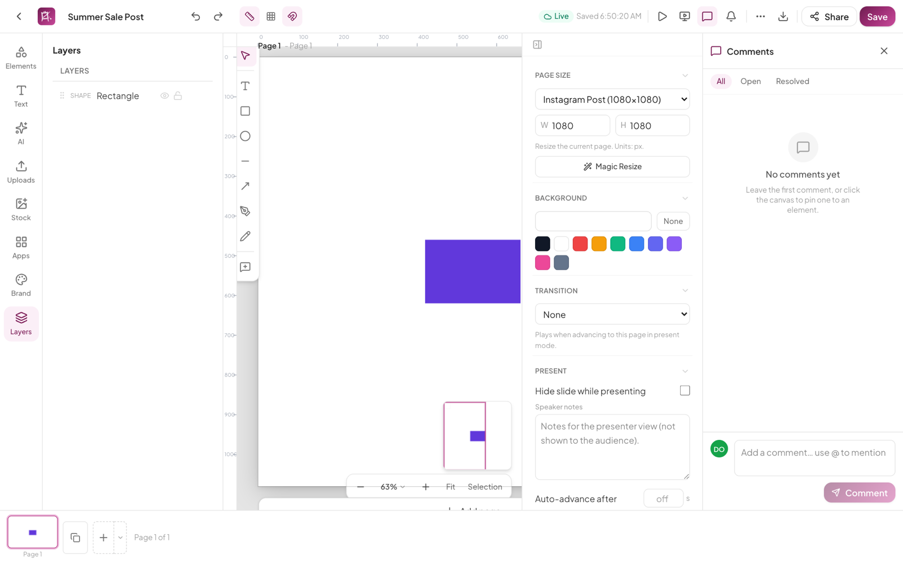
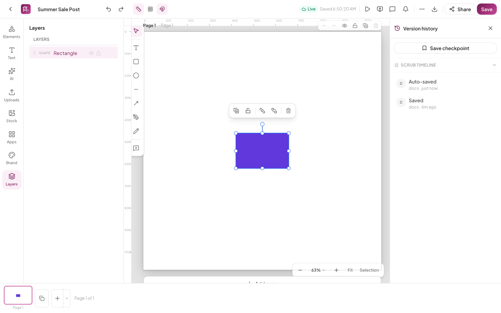
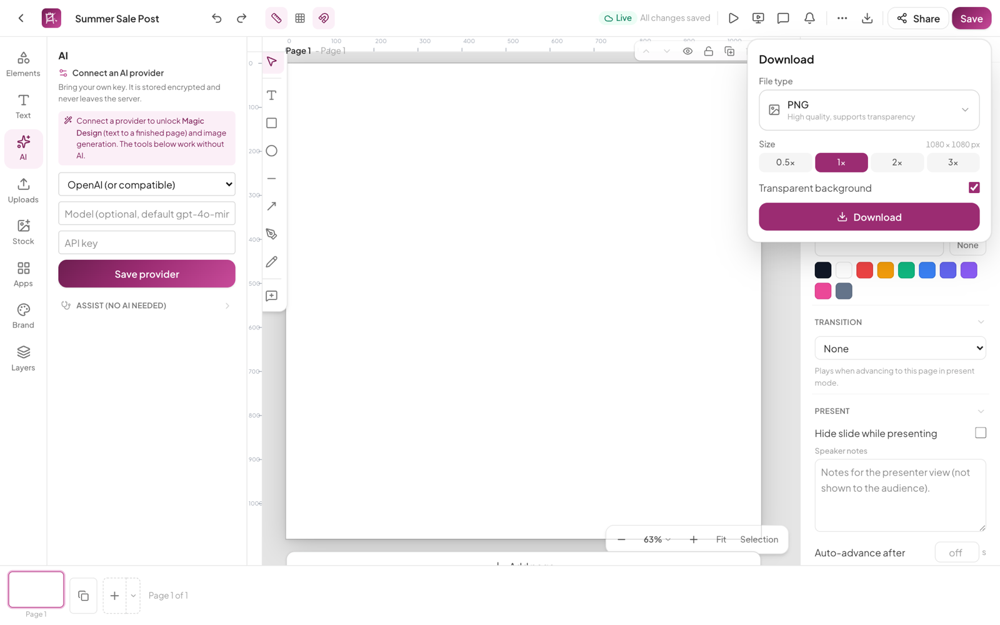

# The Editor

The editor is HyCanvas's design surface: a custom rendering engine on an HTML canvas, with content panels on the left, contextual properties on the right, and your pages along the bottom. Everything saves automatically ("All changes saved" in the top bar), and every design is collaborative in real time.

## The left rail

Each entry opens a panel next to the rail; clicking the active entry collapses it.

### Templates

The template gallery, in the editor. Templates matching the current page size are suggested first (exact size, then the same aspect ratio), with search across the whole gallery and a size badge on every card. Clicking a template adds it as a new page of the design and jumps there; it never replaces existing pages, and one undo removes it. Design documents only.

### Elements

Shapes (rectangle, rounded, ellipse, triangle, pentagon, hexagon, star, diamond, octagon, burst, pill), lines and arrows, image frames (rectangular, circle, rounded), layout grids, tables, a full chart set (bar, grouped bar, stacked bar, line, area, pie, donut, scatter, radar), and QR codes. Click to place or drag onto the canvas; a Recent row remembers what you use.

### Text

Add a text box or a preset heading, subheading, or body block. Below that: curated font pairings, a searchable font catalog with previews, and **Upload a font** (TTF, OTF, WOFF, WOFF2), which embeds the font in the design file so it travels with the document. Selecting a font applies it to selected text or inserts a new box.

### AI

HyCanvas is bring-your-own-key: connect OpenAI (or any compatible endpoint), Anthropic, DeepSeek, or a custom endpoint, per workspace. Keys are stored encrypted on the server and never in the browser. With a provider connected you get the conversational design assistant (it plans, then applies changes as undoable edits), Magic Design (text to a finished page), image generation, restyling, chart generation, and critique. Without a key, the **Assist (no AI needed)** section still offers Critique, Harmonize, Auto-layout, and Auto-animate.

### Uploads

Drag and drop files, pick from disk, import from a URL, import SVG as editable vector elements, or import a PDF as editable pages. Organize with folders, search, tag, rename, and place by click or drag. There's also a built-in screen/microphone recording helper. The usage meter shows your workspace and account storage against their limits.

### Stock

Free stock content filtered by kind (photos, illustrations, icons, emoji) with Browse, Favorites, and Recent tabs. Photos come from a bundled catalog plus live Openverse search; provenance and license are stamped on import, and attribution-required assets compile into a Credits block at export. A set of animated stickers ships too.

### Apps

A small catalog of mini-apps: QR codes, charts, tables, and shapes, with permission-scoped actions.

### Brand

The workspace Brand Kit: switch or create kits; **Apply brand** sets the design's defaults going forward, **Re-skin to brand** recolors and re-fonts the existing design. The panel also runs a live brand check with per-violation fixes and a bulk auto-fix (one undo step), and exposes colors, fonts, logos, brand voice, locked regions, and kit version history. Admins can lock brand colors and fonts, with a lint policy of off, warn, or block (block also gates export). Brand kits theme design content only; the application itself never changes with them.

### Layers

The active page's stacking order, front-most on top: two-way selection sync, show/hide, lock, rename, duplicate, delete, and drag to reorder.

## The canvas

- Drag to move; handles resize and rotate; alignment guides snap elements to each other and the page. Hold Alt while dragging to duplicate; hold Alt while hovering to measure distances.
- The selection toolbar floats above whatever you select: group/ungroup, duplicate, lock, bring to front, send to back, delete.
- Rulers with drag-out guides, a layout grid, and snapping all toggle from the top bar.
- The zoom control (bottom right) has presets, fit-page, and zoom-to-selection; a minimap appears when content extends beyond the viewport, and clicking or dragging it pans.
- Double-click text to edit in place. A path editor and crop overlay open for vector and image work.

## The properties panel

Contextual to the selection:

- **Nothing selected**: page size with presets and **Magic Resize** (switch format in place, or generate re-flowed copies for a whole social set), page background, the page transition, and present options (hide slide, speaker notes, auto-advance).
- **Elements**: position/size/rotation, shape swapping, use-as-image-frame, fills (solid, gradient, image, pattern, with harmony-based color suggestions), stroke, corner radius, opacity, and one-click effects (shadow, lift, hollow, splice, glow, neon).
- **Text**: size, line height, letter spacing, decoration, alignment, paragraph spacing, text backgrounds, and text effects.
- **Images**: filter presets (Clarendon, Noir, Sepia, and more), grouped Light/Color/Detail adjustments with auto-enhance, crop, replace, remove background, rasterize.
- **Animations**: entrance, exit, and emphasis presets (Fade, Rise, Pop, Typewriter for text, and more) with duration, delay, and easing, plus custom motion-path keyframes and photo motion (Ken Burns, parallax).

## Keyboard shortcuts

Press `?` for the full cheat sheet. Highlights (Cmd on Mac, Ctrl elsewhere):

| | |
| --- | --- |
| Tools | `V` select, `T` text, `R` rectangle, `E` ellipse, `L` line, `A` arrow, `P` pen, `B` pencil |
| Edit | `Cmd+Z`/`Shift+Cmd+Z` undo/redo, `Cmd+C/X/V` clipboard, `Shift+Cmd+V` paste in place, `Alt+Cmd+C/V` copy/paste style, `Cmd+D` duplicate, `Cmd+G`/`Shift+Cmd+G` group/ungroup, `1`-`0` set opacity |
| Arrange | `Cmd+]` forward, `Cmd+[` backward; arrows nudge 1px, `Shift`+arrows 10px |
| View | `Cmd+=`/`Cmd+-` zoom, `Cmd+0` fit page, `Shift+2` zoom to selection |
| Other | `Cmd+K` command menu, `Cmd+E` export |

Shortcuts for the editing commands are remappable under the keyboard-shortcuts dialog (per-device, with conflict warnings and reset).

The command menu (`Cmd+K`) is a fuzzy palette over inserting, editing, arranging, aligning, distributing, and boolean-combining, and doubles as an AI command bar: type what you want in plain language and it routes to the right command, applied as a normal undoable edit.

## Sharing and permissions

**Share** opens the sharing dialog:

- **Invite people** by email at Can view, Can comment, or Can edit; change or revoke per person later. Custom roles can be assigned where enabled.
- **Share links** anyone can open, each with its own access mode plus optional password, expiry date, and require-sign-in; links can be copied, rotated, disabled, or deleted at any time. The dialog warns when anonymous links exist (loudly, if one grants edit).
- **Access requests** from people who hit the design without access land at the top for one-click approve (at a chosen level) or deny.

## Collaboration

Everyone with edit access works together live: presence avatars and cursors, follow mode, element locks that release automatically, per-user undo, and offline editing (stored locally in the browser) that merges cleanly when you reconnect.

**Comments** are threaded and pinned to the canvas, with @mentions, emoji reactions, replies, resolve/reopen, and convert-to-task (assignee, status, due date); tasks show up under My tasks on the dashboard, and clicking a thread jumps to its pin.

**Approvals**: request sign-off from chosen approvers (any-of or all-of); the design shows an approval banner, and once approved it locks server-side until an owner, admin, or approver reopens it. The activity feed (overflow menu) folds edits, comments, sharing, tasks, and approvals into one timeline, and **Insights** (members and owners) shows viewers, views over time, average time, and per-page engagement.

## Version history

**Version history** (overflow menu) lists every version: auto-saves, manual saves, named checkpoints, restores, and branches. Select one to preview read-only, then **Restore** (as a new snapshot; history is never destroyed) or **Branch** it into a new design. **Scrub timeline** goes finer than snapshots: it drags through the live edit log grouped into per-author bursts, so you can step to any moment between saves and restore from there.

## Present mode

The play button presents full screen. Per-page transitions (fade, slide, push, dissolve, wipe, flip, zoom, and two morph variants including Magic Move-style matching), per-element animations, and photo motion all play as authored. Presenter tools: laser pointer (`L`), pen drawing (`D`), spotlight (`O`), zoom (`Z`), black/white screen blanking (`B`/`W`), jump-to-slide (`G`), and loop. The presenter HUD (`S`) shows current and next slides, speaker notes, and a rehearsal timer with per-slide breakdowns. Autopilot (`P`) auto-advances using per-slide dwell times.

## Export and publishing

The download icon (or `Cmd+E`) opens Export:

- **Formats**: PNG (with transparency), JPG (quality slider), PDF (multi-page), SVG, animated PNG, animated GIF, and Lottie JSON for animated pages.
- **Size**: 0.5x to 3x multipliers with live pixel dimensions; multi-page exports can combine into a zip; export all pages, the current page, or a per-page selection.
- Brand kit export policies can warn or block on violations, and a Credits block compiles attribution for stock that requires it.

Also in the overflow menu:

- **Print**: renders pages at print resolution into the OS print dialog (printer choice, copies, save-as-PDF).
- **Publish to social**: a planning workspace with per-platform sizing (Instagram, Facebook, X, LinkedIn, TikTok, Pinterest, YouTube), captions with the strictest platform's character limit, a QR generator, and a calendar planner. Note: plans stay local for now; connecting real social accounts for automatic posting is not built yet, and the dialog says so.
- **Publish as website**: generates a responsive static site from the design, with SEO fields, auto-built navigation, custom head/body code, a live desktop/tablet/mobile preview, and export of the generated files. Hosted publishing (domains, TLS) is on the roadmap; today you take the files to any static host.
- **Save as template**: name, optional category, and visibility (only me, my team, or everyone).

## Accessibility checker

**Accessibility check** (overflow menu) evaluates the design for contrast, missing alt text, small text, and tap-target size, with severity per issue; clicking an issue jumps to and selects the offending element. The command menu can generate alt text for images via your AI provider.
