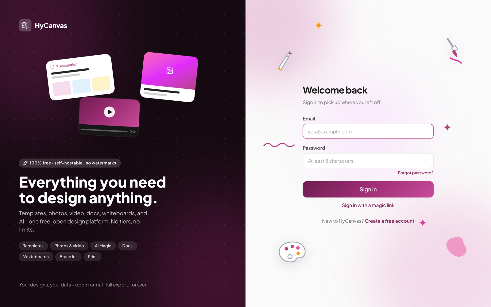
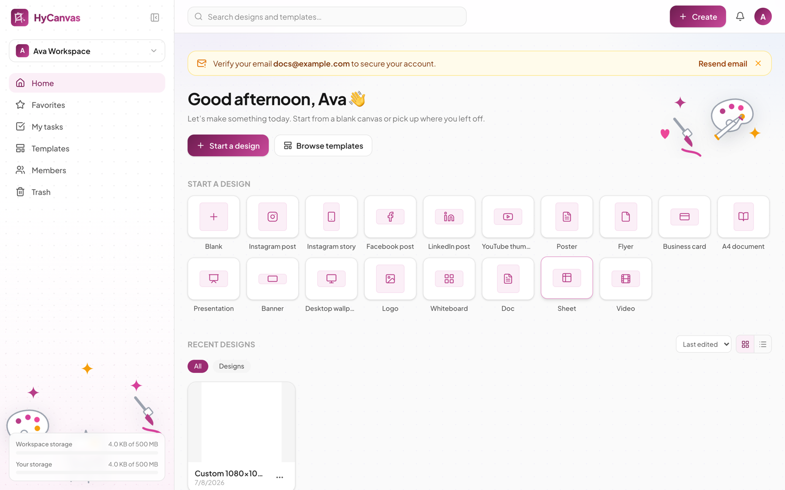
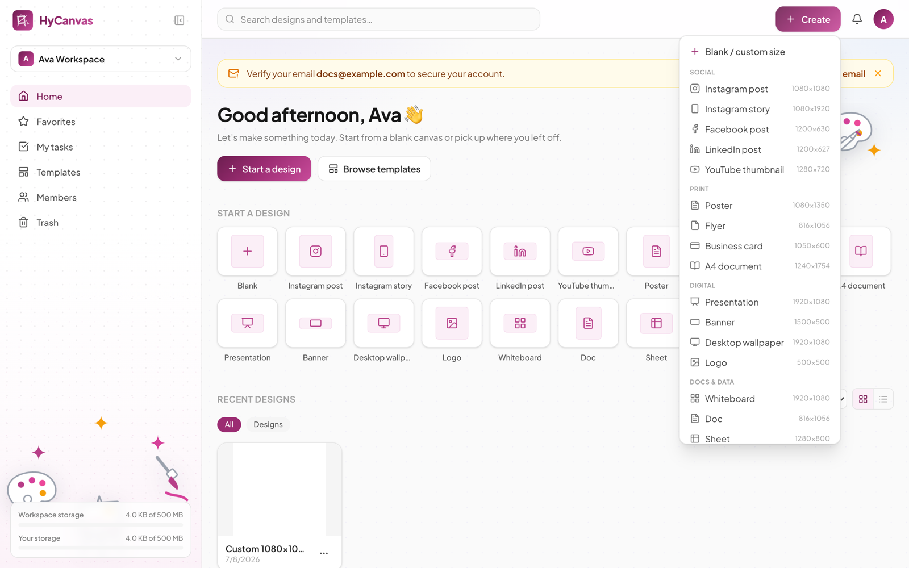
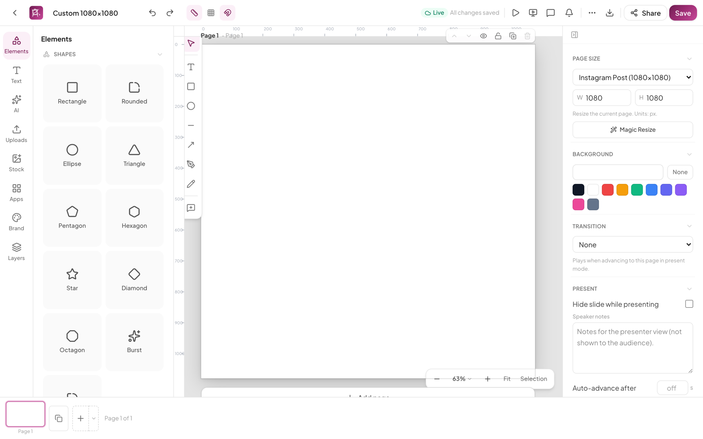

# Getting Started

This guide takes you from first sign-in to a finished first design. It assumes a running HyCanvas server; if you are the one installing it, do [that](setup-wizard.md) first.

## Create an account and sign in

Open the HyCanvas URL in a browser. Anonymous visitors land on the sign-in page.

- New here? Click **Create a free account** and sign up with your email and a password (8 characters minimum).
- Prefer not to type a password? **Sign in with a magic link** emails you a one-time link (requires the server to have email configured).
- If the operator configured an identity provider, a **Continue with Google** (or similarly labeled) button appears here too.

After signing up you receive a verification email. You can use HyCanvas right away; a banner reminds you to verify until you do.

## Meet the dashboard

Signing in lands you on the dashboard: your home for designs, templates, and workspace administration.

The essentials:

- **Start a design** or the **Create** button opens a new design in one click, sized for the format you pick.
- **Search designs and templates** finds your work and the template library from one box.
- The left sidebar navigates between Home, Favorites, My tasks, Templates, Members, and Trash, and shows your storage meters at the bottom.
- The workspace switcher (top of the sidebar) moves between workspaces; every design lives in exactly one workspace.

The [dashboard guide](dashboard.md) covers each area in depth.

## Create your first design

Click **Create**. A menu of common formats opens, grouped by purpose: social posts and stories, print formats like posters and business cards, digital formats like presentations and banners, and document types like whiteboards, docs, and sheets.

- Pick a preset (for example **Instagram post**, 1080 x 1080) and the editor opens on a blank page at that size.
- Pick **Blank / custom size** to enter your own dimensions.
- Or start from content instead: **Browse templates** opens the template library, and picking one creates a design pre-filled with it.

## Design something

The editor is where the work happens: add elements, text, uploads, and stock content from the left rail, arrange them on the canvas, and fine-tune with the properties panel on the right. Changes save automatically ("All changes saved" in the top bar).

A two-minute first design:

1. Open **Elements** in the left rail and click a shape to place it.
2. Open **Text** and add a heading; double-click it on the canvas to edit.
3. Drag things around; alignment guides snap them into place.
4. Set a page background from the properties panel on the right.
5. Click the download icon in the top bar to export, or **Share** to invite others.

The [editor guide](editor.md) walks through every panel and tool.

## Where to go next

- [The dashboard](dashboard.md): workspaces, members, templates, storage, settings.
- [The editor](editor.md): the full tour, including AI, brand kits, and export.
- Working with others? Share a design and edit it together live; presence cursors and locks keep you out of each other's way.
