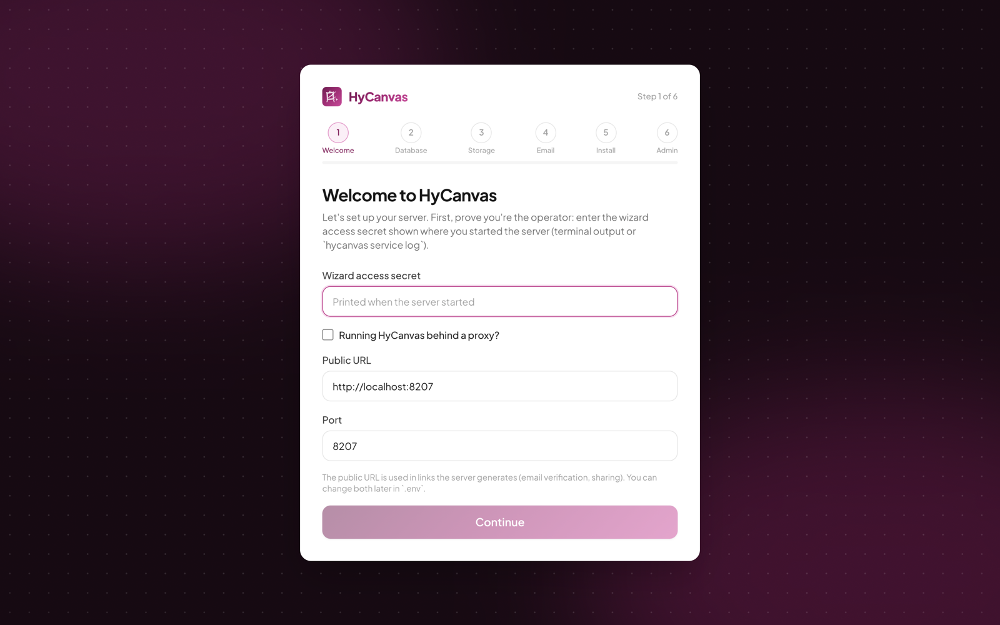

# Installing HyCanvas: the First-Run Setup Wizard

HyCanvas ships as a single binary with the web app embedded. Point it at a PostgreSQL database and it runs; the first-run wizard collects that configuration for you, validates every answer live, and writes the `.env` itself.

This page walks the wizard. For downloading the binary, the service commands, Docker, and reverse-proxy details, see the root [README](../README.md#install-a-prebuilt-binary).

## Before you start

You need:

- The `hycanvas` binary for your platform (from the [releases page](https://github.com/hyscaler/HyCanvas/releases)), run as a regular user, never root.
- A reachable PostgreSQL server and credentials.
- Optional: S3-compatible object storage (local disk works fine and can be [migrated to S3 later](../README.md#moving-from-local-storage-to-s3)).
- Optional: SMTP credentials for email (verification, invitations, magic links).

## Start the server

```bash
./hycanvas start            # foreground, or:
./hycanvas service start    # as a background service
```

With no `.env` present, an interactive terminal first asks whether to set up in the **browser** (default) or right there in the **terminal**. The CLI wizard asks the same questions with the same live validation; the rest of this page shows the browser flow.

The server then prints a one-time **wizard access secret**. Keep that terminal visible (or read it later with `./hycanvas service log`); the wizard's first step asks for it.

## Step 1: Welcome

Open the printed URL in a browser; every page redirects to the wizard while the server is unconfigured.



- **Wizard access secret**: proves to the server that you are the operator who started it, so only you can configure this instance. Wrong guesses are rate limited.
- **Running HyCanvas behind a proxy?**: enable this when nginx, Caddy, or Traefik will sit in front. The form then splits into the external **Public URL** (what users type, for example `https://hycanvas.example.com`) and the internal **bind host** and **port** the proxy forwards to (typically `127.0.0.1`). Without a proxy you just confirm the public URL and port.

Your answers are held on the server, never in browser storage; refreshing the page always restarts at this step (re-enter the secret to continue).

## Step 2: Database

Enter the PostgreSQL connection: host, port, database name, user, and password (or a full connection URL). **Test connection** verifies it live before you can continue.

## Step 3: Storage

Choose where uploaded assets and exports live:

- **Local disk** (default): a directory next to the binary. Perfect to start; migrate to S3 later without any downtime beyond a restart.
- **S3-compatible**: bucket, region, endpoint, and keys for AWS S3, MinIO, Cloudflare R2, and friends. The wizard tests the credentials against the bucket.

## Step 4: Email

Optionally configure SMTP (host, port, credentials, from-address). The wizard can send a test message. Skipping is fine: HyCanvas runs without email, you just lose verification mails, invitation mails, and magic-link sign-in until you configure it in `.env`.

## Step 5: Review and install

A summary of every answer (passwords masked). **Install HyCanvas** then runs the real thing with live progress: validate the database connection, write `.env` (secrets like `JWT_SECRET` are generated automatically), run the database migrations, and start the server in the same process. If anything fails you are sent back to the relevant step with the error.

## Step 6: Admin account

The freshly started server asks you to create the first account. From here you are in the product; the wizard never runs again for this instance.

## After the wizard

- The configuration lives in `.env` next to the binary; edit it and `./hycanvas service restart` to change anything later. See [Environment Variables](../README.md#environment-variables).
- Useful next steps in `.env`: [Google / OIDC sign-in](../README.md#sign-in-with-google-or-any-oidc-provider), storage limits (`ASSET_QUOTA_BYTES` per workspace, `USER_STORAGE_QUOTA_BYTES` per user), and [moving to S3](../README.md#moving-from-local-storage-to-s3).
- Service management: `./hycanvas service status|log|restart|stop`, and an `@reboot` cron entry (or your init system) to start it on boot.
