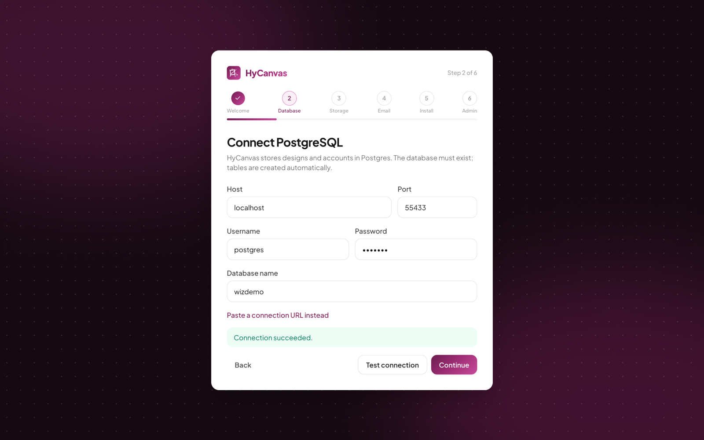
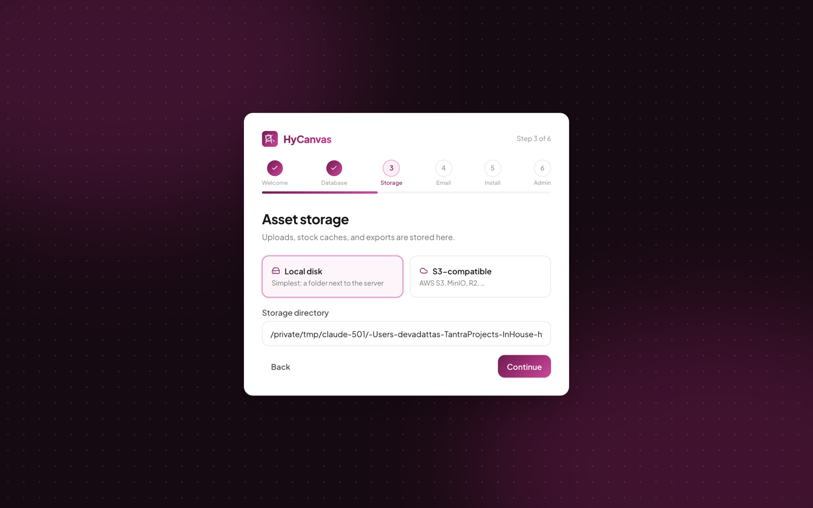
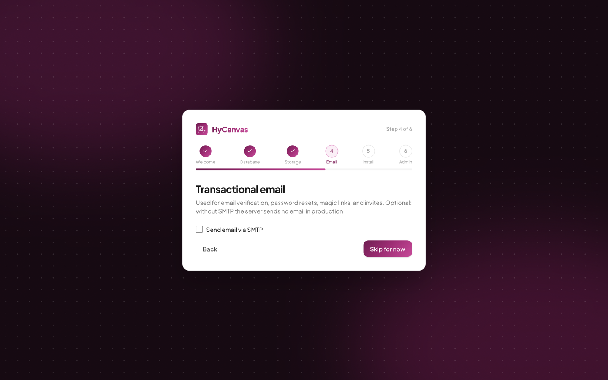
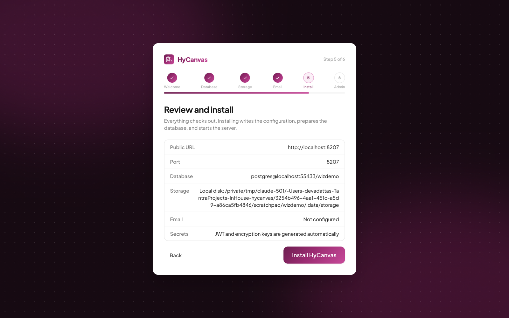
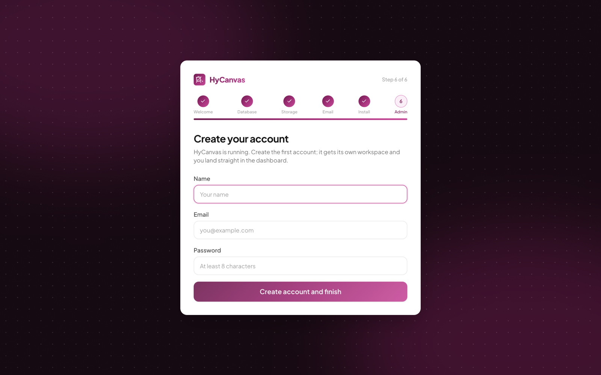

# Installing HyCanvas: the First-Run Setup Wizard

HyCanvas ships as a single binary with the web app embedded. Point it at a PostgreSQL database and it runs; the first-run wizard collects that configuration for you, validates every answer live, and writes the `.env` itself. This page walks every step with screenshots.

For downloading the binary, Docker, and reverse-proxy details, see the root [README](../README.md#install-a-prebuilt-binary).

## Before you start

- The `hycanvas` binary for your platform (from the [releases page](https://github.com/hyscaler/HyCanvas/releases)), run as a regular user, never root.
- A reachable PostgreSQL server and credentials. The database itself must exist; HyCanvas creates all tables.
- Optional: S3-compatible object storage (local disk works fine and can be [migrated to S3 later](../README.md#moving-from-local-storage-to-s3)).
- Optional: SMTP credentials for email (verification, invitations, magic links).

## Start the server

```bash
./hycanvas start            # foreground, or:
./hycanvas service start    # as a background service
```

With no `.env` present, an interactive terminal first asks whether to set up in the **browser** (default) or right there in the **terminal**. The CLI wizard asks the same questions with the same live validation; the rest of this page shows the browser flow.

The server prints the wizard URL and a one-time **wizard access secret**:

```
==> First-run setup: open http://localhost:8005/installation/step-1
==> Wizard access secret: 4f2a9c...
```

Keep that terminal visible, or read it later with `./hycanvas service log`.

## Step 1 of 6: Welcome

Open the printed URL; while the server is unconfigured, every page redirects here. The progress header across the top tracks all six steps.


- **Wizard access secret** proves you are the operator who started the server, so only you can configure this instance. Wrong guesses are rate limited.
- **Running HyCanvas behind a proxy?** Enable when nginx, Caddy, or Traefik will sit in front. The form then splits into the external **Public URL** (what users type, e.g. `https://hycanvas.example.com`) and the internal **bind host** and **port** the proxy forwards to (typically `127.0.0.1`). Without a proxy you just confirm the public URL and port.

Your answers are held on the server, never in browser storage; refreshing any wizard page restarts at this step (re-enter the secret to continue).

## Step 2 of 6: Database

Enter the PostgreSQL connection piece by piece, or click **Paste a connection URL instead** for a single `postgresql://` string. **Test connection** validates against the real server before you can continue.



## Step 3 of 6: Storage

Choose where uploaded assets and exports live:



- **Local disk** (default): a directory next to the binary. Perfect to start; the `storage migrate` command moves everything to S3 later with no database changes.
- **S3-compatible**: bucket, region, endpoint, and keys for AWS S3, MinIO, Cloudflare R2, and friends. The wizard tests the credentials against the bucket before continuing.

## Step 4 of 6: Email

Optionally configure SMTP (host, port, credentials, from-address); the wizard can send a test message before you commit. Skipping is fine: HyCanvas runs without email, you just lose verification mails, invitation mails, and magic-link sign-in until you add SMTP settings to `.env` later.



## Step 5 of 6: Review and install

A summary of every answer, passwords masked. Secrets like `JWT_SECRET` are generated for you.



**Install HyCanvas** then runs the real thing with live progress: validate the database connection, write `.env`, run the database migrations, and start the server in the same process.


If anything fails you are sent back to the relevant step with the error; nothing is half-installed.

## Step 6 of 6: Create your account

The freshly started server asks for the first account. It gets its own workspace and lands you straight in the dashboard. The wizard never runs again for this instance.



## After the wizard

- The configuration lives in `.env` next to the binary; edit it and `./hycanvas service restart` to change anything. See [Environment Variables](../README.md#environment-variables).
- Useful next steps: [Google / OIDC sign-in](../README.md#sign-in-with-google-or-any-oidc-provider), storage limits (`ASSET_QUOTA_BYTES` per workspace, `USER_STORAGE_QUOTA_BYTES` per user across workspaces), and [moving local storage to S3](../README.md#moving-from-local-storage-to-s3).
- Service management: `./hycanvas service status|log|restart|stop`; add an `@reboot` cron entry (or your init system) so it starts on boot.

## Upgrading

Releases are plain binary swaps; each release page carries notes and SHA-256 checksums.

```bash
./hycanvas service stop
cp hycanvas hycanvas.bak            # rollback insurance
tar -xzf hycanvas_vX.Y.Z_linux_amd64.tar.gz   # replaces ./hycanvas
./hycanvas service start            # migrations run automatically on boot
```

The database migrates forward automatically on startup, and opening older design files always succeeds (the open file format carries forward migrations). To roll back, stop, restore the backed-up binary, and start again.
